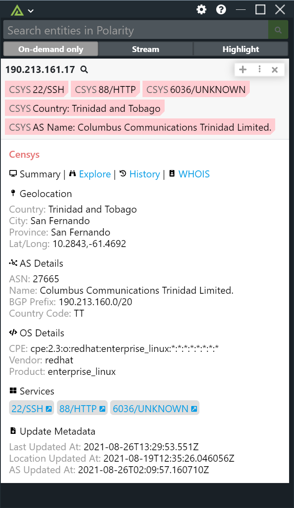

# Polarity Censys Integration

The Polarity Censys integration allows the Polarity user to quickly perform research against the Censys "hosts" API endpoint. Fetches the entire host entity by IP address and returns the most recent Censys view of the host and its services.

Check out the integration below!

## Censys Integration Options

### Base URL for the Censys REST API
The base URL for the Censys REST API including the schema (i.e., https://). Defaults to `https://search.censys.io/api`

### API ID
API ID provided when you sign up for a Censys API account.

### API Secret
API Secret ID provided when you sign up for a Censys API account.

## Installation Instructions

Installation instructions for integrations are provided on the [PolarityIO GitHub Page](https://polarityio.github.io/).

## Polarity

Polarity is a memory-augmentation platform that improves and accelerates analyst decision making.  For more information about the Polarity platform please see:

https://polarity.io/
