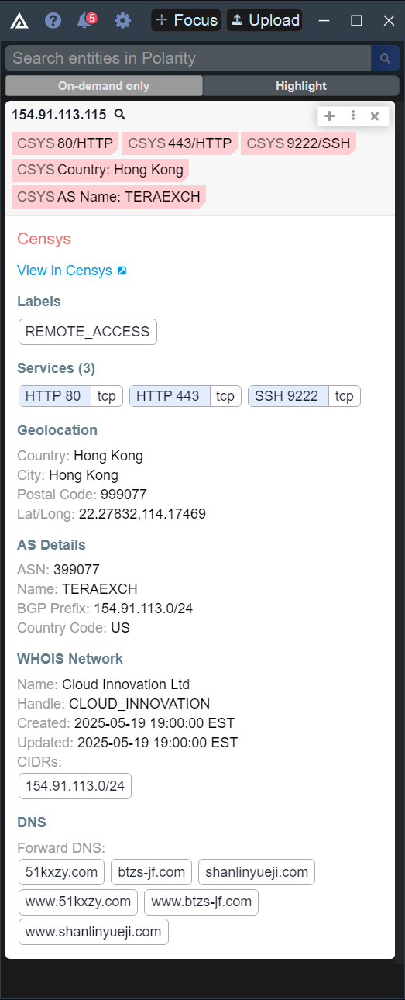

# Polarity Censys Integration

The Polarity Censys integration allows the Polarity user to quickly perform research against the Censys "hosts" API endpoint. Fetches the entire host entity by IP address and returns the most recent Censys view of the host and its services.

Check out the integration below!

Starting with version 3.3.0 of the Polarity-Censys Integration, only the Censys v3 API is supported.  The integration no longer supports the legacy Censys Search API.

## Censys Integration Options

### Base URL for the Censys REST API
The base URL for the Censys REST API including the schema (i.e., https://). Defaults to `https://api.platform.censys.io`

### Access Token
A Censys Personal Access Token used for authenticating to the Censys API

### Censys Organization ID
The Censys Organization ID associated with the provided Access Token. The Organization ID can be determined by navigating to the "My Account" page and looking for the `org` parameter in the URL. The Organization ID is a UUID with the format XXXXXXXX-XXXX-XXXX-XXXX-XXXXXXXXXXXX.

## Installation Instructions

Installation instructions for integrations are provided on the [PolarityIO GitHub Page](https://polarityio.github.io/).

## Polarity

Polarity is a memory-augmentation platform that improves and accelerates analyst decision making.  For more information about the Polarity platform please see:

https://polarity.io/
